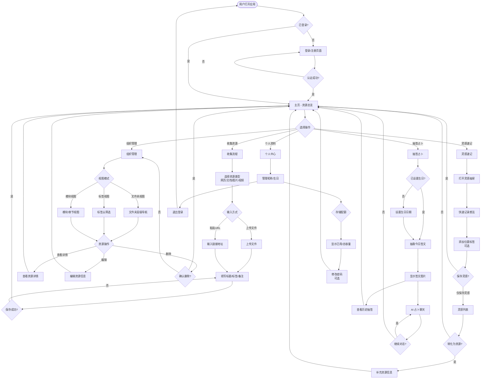
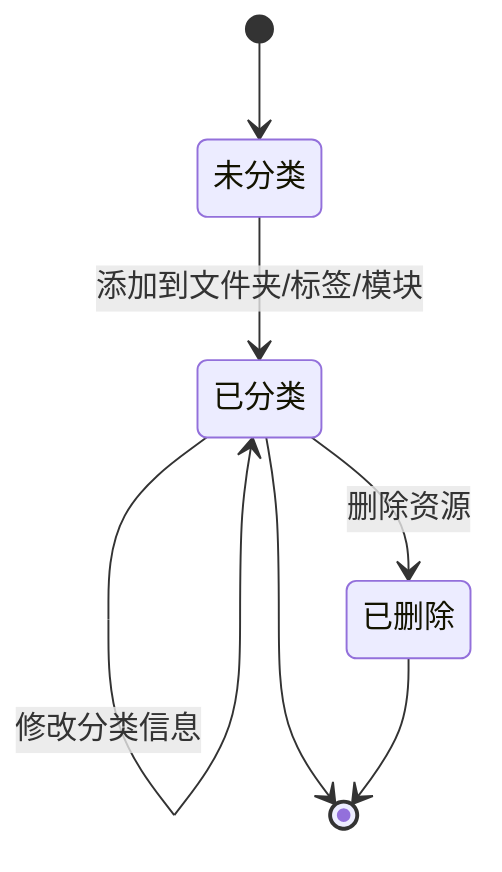
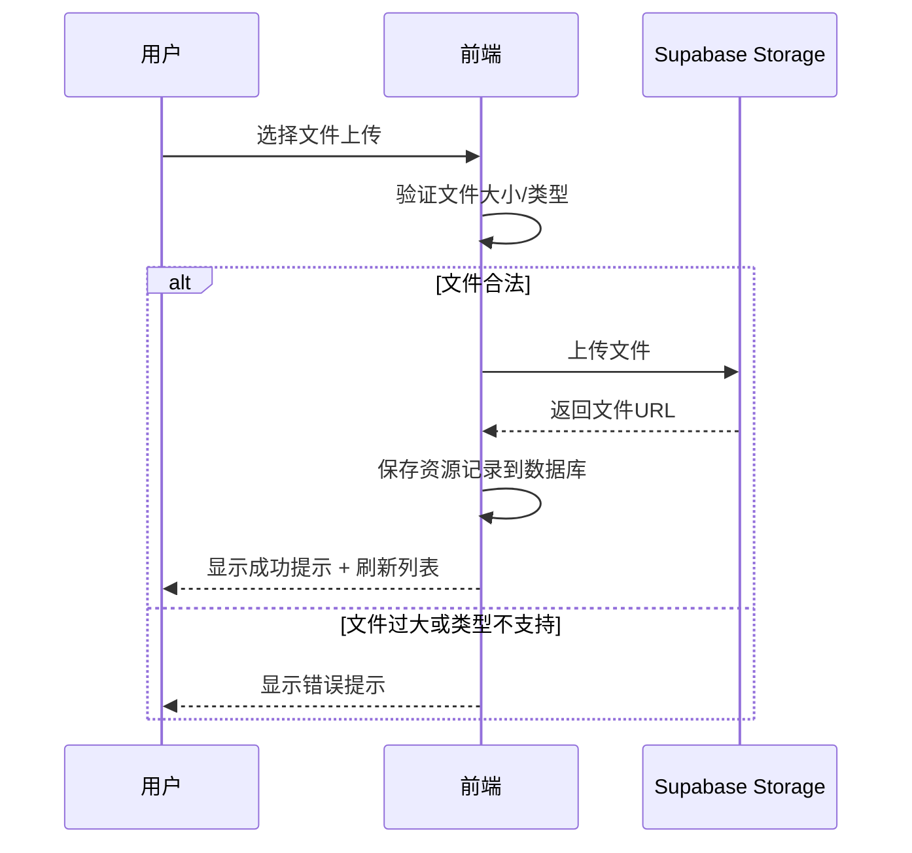

# 产品需求文档：TimePick (拾光) - 核心功能基线

## 1. 综述 (Overview)

### 1.1 项目背景与核心问题

**TimePick (拾光)** 是一个**个人知识管理与资源收集应用**，旨在帮助用户高效地收集、组织和管理各类数字资源（网页、文档、图片、视频），同时提供灵感速记和趣味性的抽签占卜功能。

**核心问题解决：**
- **信息分散**：用户在不同平台保存的链接、文件、笔记分散在各处，难以统一管理
- **组织混乱**：缺乏灵活的多维度分类方式（文件夹、标签、模块视图）
- **灵感流失**：突然的想法和灵感没有便捷的记录方式
- **情感连接**：缺乏趣味性的日常互动（抽签占卜）来增加用户粘性

### 1.2 核心业务流程 / 用户旅程地图

1. **阶段一：账户与身份** - 建立用户身份、设置个人资料（特别是生日，用于抽签功能）
2. **阶段二：资源收集** - 收集各类资源（网页/文档/图片/视频），建立内容库
3. **阶段三：组织管理** - 通过文件夹、标签、模块/章节多维度组织资源
4. **阶段四：灵感速记** - 随时记录想法，并可将灵感转化为正式资源
5. **阶段五：抽签占卜** - 基于生日抽取每日签文，AI 占卜聊天增加互动

### 1.3 Mermaid 图（流程/状态/时序）

#### 1.3.1 用户操作流（必填）



#### 1.3.2 状态机（资源生命周期）



#### 1.3.3 关键场景时序（文件上传）



---

## 2. 用户故事详述 (User Stories)

### 阶段一：账户与身份

---

#### **US-01: 用户注册与登录**
*   **价值陈述 (Value Statement)**:
    *   **作为** 新用户
    *   **我希望** 能够通过用户名和密码注册账号并登录
    *   **以便于** 个性化管理我的资源和数据
*   **业务规则与逻辑 (Business Logic)**:
    1.  **前置条件**: 无
    2.  **操作流程 (Happy Path)**:
        - 用户访问应用，未登录状态跳转到登录页
        - 用户选择"注册"或"登录"
        - 注册：输入用户名、密码、昵称 → 提交 → 系统验证用户名唯一性 → 创建账号 → 自动登录
        - 登录：输入用户名、密码 → 提交 → 系统验证凭证 → 验证成功跳转到主页
    3.  **异常处理 (Error Handling)**:
        - 用户名已存在：提示"用户名已被使用，请换一个"
        - 密码错误：提示"用户名或密码错误"
        - 网络错误：提示"网络连接失败，请稍后重试"
        - 用户名为空或密码少于6位：提示输入验证错误
*   **验收标准 (Acceptance Criteria)**:
    *   **场景1: 成功注册**
        *   **GIVEN** 用户在注册页面，且用户名未被占用
        *   **WHEN** 用户输入有效用户名、密码、昵称并提交
        *   **THEN** 系统创建账号，用户自动登录并跳转到主页
    *   **场景2: 用户名重复**
        *   **GIVEN** 用户在注册页面
        *   **WHEN** 用户输入已存在的用户名并提交
        *   **THEN** 系统显示"用户名已被使用"错误提示
    *   **场景3: 登录失败**
        *   **GIVEN** 用户在登录页面
        *   **WHEN** 用户输入错误的密码
        *   **THEN** 系统显示"用户名或密码错误"提示
---

*   **页面布局线框图 (ASCII Wireframe)**:
    ```text
    ┌─────────────────────────────────────┐
    │                                     │
    │         TimePick (拾光)              │
    │                                     │
    │   ┌─────────────────────────────┐   │
    │   │                             │   │
    │   │   [登录 / 注册 切换Tab]     │   │
    │   │                             │   │
    │   │   用户名: [_______________]   │   │
    │   │                             │   │
    │   │   密码:   [_______________]   │   │
    │   │                             │   │
    │   │   [        登录         ]    │   │
    │   │                             │   │
    │   └─────────────────────────────┘   │
    │                                     │
    └─────────────────────────────────────┘
    ```

---

#### **US-02: 个人资料管理**
*   **价值陈述 (Value Statement)**:
    *   **作为** 已登录用户
    *   **我希望** 能够查看和修改我的个人资料（昵称、生日）
    *   **以便于** 使用抽签功能（需要生日）和个性化体验
*   **业务规则与逻辑 (Business Logic)**:
    1.  **前置条件**: 用户已登录
    2.  **操作流程 (Happy Path)**:
        - 用户进入"个人中心"页面
        - 查看当前昵称、生日、存储配额使用情况
        - 点击"编辑"按钮修改昵称或生日
        - 保存后更新数据库并显示成功提示
    3.  **异常处理 (Error Handling)**:
        - 昵称为空：提示"昵称不能为空"
        - 生日格式错误：提示"请选择有效的日期"
        - 存储配额超限：警告"存储空间已满，无法上传新资源"
*   **验收标准 (Acceptance Criteria)**:
    *   **场景1: 查看个人资料**
        *   **GIVEN** 用户已登录
        *   **WHEN** 用户进入个人中心页面
        *   **THEN** 显示昵称、生日、存储配额（已用/总量）
    *   **场景2: 修改昵称**
        *   **GIVEN** 用户在个人中心页面
        *   **WHEN** 用户修改昵称并保存
        *   **THEN** 系统更新昵称并显示"保存成功"
    *   **场景3: 设置生日**
        *   **GIVEN** 用户在个人中心页面，且未设置生日
        *   **WHEN** 用户选择生日日期并保存
        *   **THEN** 系统保存生日，用户可使用抽签功能
---
*   **页面布局线框图 (ASCII Wireframe)**:
    ```text
    ┌─────────────────────────────────────┐
    │  个人中心          [编辑] [退出登录]│
    ├─────────────────────────────────────┤
    │                                     │
    │  昵称: Lee                          │
    │  生日: 1990-01-01                   │
    │  用户名: lee_user                   │
    │                                     │
    │  存储空间使用情况                    │
    │  ██████████░░░░░░░░ 52%            │
    │  520 MB / 1000 MB                   │
    │                                     │
    │  [ 修改密码 ]                        │
    │                                     │
    └─────────────────────────────────────┘
    ```

---

### 阶段二：资源收集

---

#### **US-03: 添加新资源（文件上传）**
*   **价值陈述 (Value Statement)**:
    *   **作为** 用户
    *   **我希望** 能够上传本地文件（文档、图片、视频）到资源库
    *   **以便于** 集中管理我的数字资产
*   **业务规则与逻辑 (Business Logic)**:
    1.  **前置条件**: 用户已登录，存储空间未满
    2.  **操作流程 (Happy Path)**:
        - 用户点击"添加资源"按钮
        - 选择资源类型（文档/图片/视频）
        - 点击上传区域或拖拽文件
        - 系统验证文件大小和类型
        - 上传文件到 Supabase Storage
        - 保存资源记录到数据库（包含文件URL、大小、类型）
        - 显示成功提示并刷新资源列表
    3.  **异常处理 (Error Handling)**:
        - 文件过大：提示"文件大小超过限制（最大XX MB）"
        - 文件类型不匹配：提示"请上传正确的文件类型"
        - 存储空间不足：提示"存储空间已满，请升级或删除部分资源"
        - 网络上传失败：提示"上传失败，请重试"
*   **验收标准 (Acceptance Criteria)**:
    *   **场景1: 成功上传图片**
        *   **GIVEN** 用户在主页，存储空间充足
        *   **WHEN** 用户选择"图片"类型并上传一张 JPG 文件
        *   **THEN** 文件上传成功，资源列表显示新图片，生成缩略图
    *   **场景2: 文件过大**
        *   **GIVEN** 用户在主页
        *   **WHEN** 用户上传超过大小限制的文件
        *   **THEN** 系统显示"文件过大"错误提示，不上传
    *   **场景3: 存储空间不足**
        *   **GIVEN** 用户存储配额已用98%
        *   **WHEN** 用户上传一个较大的文件
        *   **THEN** 系统显示"存储空间不足"警告
---
*   **页面布局线框图 (ASCII Wireframe)**:
    ```text
    ┌─────────────────────────────────────┐
    │  添加资源                    [×]   │
    ├─────────────────────────────────────┤
    │                                     │
    │  资源类型: ○网页 ○文档 ●图片 ○视频 │
    │                                     │
    │  ┌─────────────────────────────┐   │
    │  │                             │   │
    │  │     拖拽文件到此处          │   │
    │  │     或点击上传               │   │
    │  │                             │   │
    │  └─────────────────────────────┘   │
    │                                     │
    │  标题: [________________]           │
    │  标签: [添加标签...]               │
    │  备注: [________________]           │
    │                                     │
    │        [取消]      [保存]           │
    └─────────────────────────────────────┘
    ```

---

#### **US-04: 添加新资源（网页链接）**
*   **价值陈述 (Value Statement)**:
    *   **作为** 用户
    *   **我希望** 能够通过粘贴 URL 快速保存网页链接
    *   **以便于** 稍后阅读或归档有价值的网页内容
*   **业务规则与逻辑 (Business Logic)**:
    1.  **前置条件**: 用户已登录
    2.  **操作流程 (Happy Path)**:
        - 用户点击"添加资源"按钮
        - 选择"网页"类型
        - 粘贴 URL 地址
        - 系统自动获取网页标题（可选）
        - 用户填写标题、标签、备注
        - 保存后创建资源记录
    3.  **异常处理 (Error Handling)**:
        - URL 格式错误：提示"请输入有效的网址"
        - 网络无法访问：提示"无法获取该网页，请检查网址"
*   **验收标准 (Acceptance Criteria)**:
    *   **场景1: 成功保存网页链接**
        *   **GIVEN** 用户在添加资源对话框
        *   **WHEN** 用户粘贴 URL 并填写标题后保存
        *   **THEN** 资源列表显示新网页链接，可点击跳转
    *   **场景2: URL 格式错误**
        *   **GIVEN** 用户在添加资源对话框
        *   **WHEN** 用户输入无效的 URL（如 "abc"）
        *   **THEN** 系统显示"请输入有效的网址"错误提示
---

#### **US-05: 资源搜索与筛选**
*   **价值陈述 (Value Statement)**:
    *   **作为** 用户
    *   **我希望** 能够通过关键词搜索资源
    *   **以便于** 快速找到我需要的内容
*   **业务规则与逻辑 (Business Logic)**:
    1.  **前置条件**: 用户已登录，且至少有一条资源
    2.  **操作流程 (Happy Path)**:
        - 用户在搜索框输入关键词
        - 系统实时过滤资源（标题、标签、备注、URL 均在搜索范围内）
        - 显示匹配结果列表
        - 点击结果可查看详情
    3.  **异常处理 (Error Handling)**:
        - 无搜索结果：显示"未找到相关资源"空状态
*   **验收标准 (Acceptance Criteria)**:
    *   **场景1: 搜索成功**
        *   **GIVEN** 用户在主页，有多个资源
        *   **WHEN** 用户输入搜索关键词"设计"
        *   **THEN** 列表仅显示标题/标签/备注中包含"设计"的资源
    *   **场景2: 无结果**
        *   **GIVEN** 用户在主页
        *   **WHEN** 用户输入不存在的关键词
        *   **THEN** 显示空状态提示"未找到相关资源"
---

### 阶段三：组织管理

---

#### **US-06: 文件夹层级管理**
*   **价值陈述 (Value Statement)**:
    *   **作为** 用户
    *   **我希望** 能够创建文件夹并建立层级结构
    *   **以便于** 按项目或主题分类组织资源
*   **业务规则与逻辑 (Business Logic)**:
    1.  **前置条件**: 用户已登录
    2.  **操作流程 (Happy Path)**:
        - 用户在文件夹树视图点击"新建文件夹"
        - 输入文件夹名称
        - 选择父文件夹（可选，用于创建子文件夹）
        - 保存后文件夹树刷新
        - 用户可拖拽资源到文件夹，或拖拽文件夹调整层级
    3.  **异常处理 (Error Handling)**:
        - 文件夹名称为空：提示"文件夹名称不能为空"
        - 文件夹名称重复：提示"该名称已被使用"
*   **验收标准 (Acceptance Criteria)**:
    *   **场景1: 创建顶层文件夹**
        *   **GIVEN** 用户在文件夹视图
        *   **WHEN** 用户点击"新建文件夹"并输入名称
        *   **THEN** 新文件夹出现在文件夹树中
    *   **场景2: 创建子文件夹**
        *   **GIVEN** 用户在文件夹视图，有"工作"文件夹
        *   **WHEN** 用户在"工作"文件夹下创建"项目A"子文件夹
        *   **THEN** "项目A"作为"工作"的子节点显示
    *   **场景3: 拖拽资源到文件夹**
        *   **GIVEN** 用户有未分类的资源和一个文件夹
        *   **WHEN** 用户拖拽资源到文件夹
        *   **THEN** 资源归属到该文件夹
---
*   **页面布局线框图 (ASCII Wireframe)**:
    ```text
    ┌──────────────┬──────────────────────────┐
    │ 文件夹       │ 资源列表                 │
    ├──────────────┤                          │
    │ ▼ 工作区     │ ┌────────────────────┐   │
    │   📁 项目A   │ │ 📄 产品需求文档    │   │
    │   📁 项目B   │ │    标签: 文档 工作  │   │
    │              │ └────────────────────┘   │
    │ 📁 学习资料   │ ┌────────────────────┐   │
    │              │ │ 🖼️ 界面设计稿.png  │   │
    │ 📁 个人生活   │ │    标签: 图片 设计  │   │
    │              │ └────────────────────┘   │
    │ [+ 新建文件夹]│                          │
    └──────────────┴──────────────────────────┘
    ```

---

#### **US-07: 标签多维度分类**
*   **价值陈述 (Value Statement)**:
    *   **作为** 用户
    *   **我希望** 能够为资源添加多个标签并通过标签筛选
    *   **以便于** 从多个维度快速找到相关资源
*   **业务规则与逻辑 (Business Logic)**:
    1.  **前置条件**: 用户已登录
    2.  **操作流程 (Happy Path)**:
        - 用户在"标签云"视图查看所有标签
        - 点击某个标签，系统筛选包含该标签的资源
        - 用户可同时点击多个标签进行"与/或"筛选
        - 在添加/编辑资源时可创建新标签
    3.  **异常处理 (Error Handling)**:
        - 标签名称为空：提示"标签名称不能为空"
        - 删除标签：提示"删除标签不会删除资源，是否确认？"
*   **验收标准 (Acceptance Criteria)**:
    *   **场景1: 通过标签筛选**
        *   **GIVEN** 用户在标签云视图，有多个带标签的资源
        *   **WHEN** 用户点击"设计"标签
        *   **THEN** 资源列表仅显示包含"设计"标签的资源
    *   **场景2: 多标签筛选**
        *   **GIVEN** 用户在标签云视图
        *   **WHEN** 用户同时选择"设计"和"文档"标签
        *   **THEN** 资源列表显示同时包含这两个标签的资源
    *   **场景3: 创建新标签**
        *   **GIVEN** 用户在添加资源对话框
        *   **WHEN** 用户输入新标签名"重要"并保存
        *   **THEN** 新标签"重要"出现在标签云中
---
*   **页面布局线框图 (ASCII Wireframe)**:
    ```text
    ┌─────────────────────────────────────┐
    │  标签云视图                         │
    ├─────────────────────────────────────┤
    │                                     │
    │  [设计]        12个资源             │
    │  [文档]         8个资源             │
    │  [图片]        15个资源             │
    │  [工作]        10个资源             │
    │  [学习]         7个资源             │
    │  [重要]         5个资源             │
    │  [+ 管理标签]                      │
    │                                     │
    │  当前筛选: [设计] AND [文档]       │
    │  (共 3 个资源)                     │
    │                                     │
    └─────────────────────────────────────┘
    ```

---

#### **US-08: 模块/章节视图切换**
*   **价值陈述 (Value Statement)**:
    *   **作为** 用户
    *   **我希望** 能够通过"模块"和"章节"两个维度组织资源
    *   **以便于** 灵活切换不同的分类视角
*   **业务规则与逻辑 (Business Logic)**:
    1.  **前置条件**: 用户已登录，管理员已预置模块和章节
    2.  **操作流程 (Happy Path)**:
        - 用户在资源列表点击"模块视图"或"章节视图"
        - 模块视图：按模块分组显示资源
        - 章节视图：按内容类型（网页/文档/图片/视频）分组显示资源
        - 用户可点击模块/章节展开/折叠资源列表
    3.  **异常处理 (Error Handling)**: 无
*   **验收标准 (Acceptance Criteria)**:
    *   **场景1: 切换到模块视图**
        *   **GIVEN** 用户在主页
        *   **WHEN** 用户点击"模块视图"按钮
        *   **THEN** 资源按模块分组显示，每个模块显示其下的资源
    *   **场景2: 切换到章节视图**
        *   **GIVEN** 用户在主页
        *   **WHEN** 用户点击"章节视图"按钮
        *   **THEN** 资源按内容类型（网页/文档/图片/视频）分组显示
---

### 阶段四：灵感速记

---

#### **US-09: 快速记录灵感**
*   **价值陈述 (Value Statement)**:
    *   **作为** 用户
    *   **我希望** 能够随时打开抽屉快速记录灵感
    *   **以便于** 捕捉稍纵即逝的想法
*   **业务规则与逻辑 (Business Logic)**:
    1.  **前置条件**: 用户已登录
    2.  **操作流程 (Happy Path)**:
        - 用户点击主页的"灵感"按钮打开抽屉
        - 输入灵感内容
        - 可选添加位置标签（如"家里"、"公司"、"在路上"）
        - 点击"保存"，灵感记录到数据库
        - 抽屉可随时关闭，不影响主页面操作
    3.  **异常处理 (Error Handling)**:
        - 内容为空：提示"灵感内容不能为空"
*   **验收标准 (Acceptance Criteria)**:
    *   **场景1: 保存灵感**
        *   **GIVEN** 用户在主页
        *   **WHEN** 用户打开灵感抽屉，输入内容并保存
        *   **THEN** 灵感保存成功，抽屉显示灵感列表
    *   **场景2: 添加位置标签**
        *   **GIVEN** 用户在灵感抽屉中
        *   **WHEN** 用户添加位置标签"家里"并保存
        *   **THEN** 灵感记录显示"家里"标签
---
*   **页面布局线框图 (ASCII Wireframe)**:
    ```text
    ┌─────────────────────────────────────┐
    │  灵感抽屉                       [×] │
    ├─────────────────────────────────────┤
    │                                     │
    │  灵感内容:                          │
    │  [________________________]          │
    │  [________________________]          │
    │                                     │
    │  位置: [家里 ▼]                      │
    │                                     │
    │        [保存]                       │
    │                                     │
    │  ───────── 历史灵感 ─────────        │
    │                                     │
    │  • 今天下班去买咖啡                   │
    │    家里 | 2小时前                    │
    │                                     │
    │  • 新产品功能想法：支持快捷键         │
    │    公司 | 昨天                        │
    │                                     │
    └─────────────────────────────────────┘
    ```

---

#### **US-10: 灵感转化为资源**
*   **价值陈述 (Value Statement)**:
    *   **作为** 用户
    *   **我希望** 能够将灵感转化为正式资源
    *   **以便于** 将想法深化为可管理的内容
*   **业务规则与逻辑 (Business Logic)**:
    1.  **前置条件**: 用户已登录，且至少有一条灵感
    2.  **操作流程 (Happy Path)**:
        - 用户在灵感列表点击某条灵感的"转化为资源"按钮
        - 系统打开"添加资源"对话框，预填充灵感内容
        - 用户补充标题、标签、备注等信息
        - 保存后创建资源，灵感保持不变（或标记为已转化）
    3.  **异常处理 (Error Handling)**:
        - 必填信息缺失：按"添加资源"的验证规则提示
*   **验收标准 (Acceptance Criteria)**:
    *   **场景1: 灵感转化为资源**
        *   **GIVEN** 用户有一条灵感"新产品功能想法"
        *   **WHEN** 用户点击"转化为资源"，填写标题并保存
        *   **THEN** 新资源出现在资源列表，灵感保留在灵感列表
    *   **场景2: 转化后灵感标记**
        *   **GIVEN** 用户将灵感转化为资源
        *   **WHEN** 用户查看灵感列表
        *   **THEN** 该灵感显示"已转化为资源"标记
---

### 阶段五：抽签占卜

---

#### **US-11: 每日抽签**
*   **价值陈述 (Value Statement)**:
    *   **作为** 用户
    *   **我希望** 能够基于生日抽取每日签文
    *   **以便于** 获得每日运势指引，增加趣味性
*   **业务规则与逻辑 (Business Logic)**:
    1.  **前置条件**: 用户已设置生日
    2.  **操作流程 (Happy Path)**:
        - 用户点击"抽签"按钮
        - 系统调用 Supabase Edge Function `draw-fortune`
        - 基于生日和当前日期生成签文
        - 返回签文图片和文字
        - 显示抽签结果，保存到抽签历史
    3.  **异常处理 (Error Handling)**:
        - 未设置生日：提示"请先设置生日"
        - 今日已抽签：显示历史抽签结果，提示"今日已抽签"
        - AI 接口失败：提示"抽签失败，请稍后重试"
*   **验收标准 (Acceptance Criteria)**:
    *   **场景1: 成功抽签**
        *   **GIVEN** 用户已设置生日，今日未抽签
        *   **WHEN** 用户点击"抽签"按钮
        *   **THEN** 显示签文图片和文字，保存到历史记录
    *   **场景2: 今日已抽签**
        *   **GIVEN** 用户今日已抽签
        *   **WHEN** 用户再次点击"抽签"
        *   **THEN** 显示今日的抽签结果，提示"今日已抽签"
    *   **场景3: 未设置生日**
        *   **GIVEN** 用户未设置生日
        *   **WHEN** 用户点击"抽签"
        *   **THEN** 提示"请先设置生日"，跳转到个人资料页
---
*   **页面布局线框图 (ASCII Wireframe)**:
    ```text
    ┌─────────────────────────────────────┐
    │  每日抽签                       [×] │
    ├─────────────────────────────────────┤
    │                                     │
    │         ┌─────────────────┐          │
    │         │                 │          │
    │         │   [签文图片]     │          │
    │         │                 │          │
    │         └─────────────────┘          │
    │                                     │
    │         上上签 • 大吉                 │
    │                                     │
    │  今日运势：事业顺利，贵人相助，      │
    │  勇往直前，必有收获。               │
    │                                     │
    │  [查看历史]  [AI解读]               │
    │                                     │
    └─────────────────────────────────────┘
    ```

---

#### **US-12: AI 占卜聊天**
*   **价值陈述 (Value Statement)**:
    *   **作为** 用户
    *   **我希望** 能够与 AI 聊天深入解读我的签文
    *   **以便于** 获得更个性化的运势分析
*   **业务规则与逻辑 (Business Logic)**:
    1.  **前置条件**: 用户已抽签，或已设置生日
    2.  **操作流程 (Happy Path)**:
        - 用户进入"AI 占卜"页面
        - 系统显示聊天界面
        - 用户输入问题（如"我的事业发展如何？"）
        - 系统调用 Supabase Edge Function `fortune-agent`
        - 集成阿里云 AI Agent 返回解读内容
        - 显示 AI 回复（Markdown 格式）
        - 用户可继续对话追问
    3.  **异常处理 (Error Handling)**:
        - AI 接口失败：提示"AI 暂时无法回复，请稍后重试"
        - 超时：提示"请求超时，请重试"
*   **验收标准 (Acceptance Criteria)**:
    *   **场景1: AI 回复**
        *   **GIVEN** 用户在 AI 占卜聊天页面
        *   **WHEN** 用户发送问题"我的爱情运势如何？"
        *   **THEN** AI 基于生日和签文返回个性化解读
    *   **场景2: 多轮对话**
        *   **GIVEN** 用户在聊天中
        *   **WHEN** 用户追问"那我应该注意什么？"
        *   **THEN** AI 继续对话，给出具体建议
    *   **场景3: AI 失败**
        *   **GIVEN** 用户在聊天中
        *   **WHEN** AI 接口调用失败
        *   **THEN** 显示错误提示"AI 暂时无法回复，请稍后重试"
---
*   **页面布局线框图 (ASCII Wireframe)**:
    ```text
    ┌─────────────────────────────────────┐
    │  AI 占卜聊天              [清空]    │
    ├─────────────────────────────────────┤
    │                                     │
    │  用户: 我的爱情运势如何？           │
    │                                     │
    │  AI: 根据你的生日和今日签文...      │
    │      本月你的爱情运势较好...         │
    │      建议多参加社交活动...          │
    │                                     │
    │  用户: 那我应该注意什么？           │
    │                                     │
    │  AI: [输入中...]                   │
    │                                     │
    ├─────────────────────────────────────┤
    │ [__________________]        [发送] │
    └─────────────────────────────────────┘
    ```

---

#### **US-13: 抽签历史查看**
*   **价值陈述 (Value Statement)**:
    *   **作为** 用户
    *   **我希望** 能够查看历史抽签记录
    *   **以便于** 回顾过去的运势和签文
*   **业务规则与逻辑 (Business Logic)**:
    1.  **前置条件**: 用户已登录，且至少有一次抽签记录
    2.  **操作流程 (Happy Path)**:
        - 用户在抽签对话框点击"查看历史"
        - 系统按时间倒序显示抽签历史
        - 显示日期、签文图片、签文类型（上上签/中签/下签等）
        - 点击某条历史可查看详情
    3.  **异常处理 (Error Handling)**:
        - 无历史记录：显示空状态"暂无抽签记录"
*   **验收标准 (Acceptance Criteria)**:
    *   **场景1: 查看历史**
        *   **GIVEN** 用户有多次抽签记录
        *   **WHEN** 用户点击"查看历史"
        *   **THEN** 显示按时间倒序的抽签列表
    *   **场景2: 无历史记录**
        *   **GIVEN** 用户首次使用抽签功能
        *   **WHEN** 用户点击"查看历史"
        *   **THEN** 显示空状态提示"暂无抽签记录"
---

## 3. 附录

### 3.1 数据库表结构（核心表）

**profiles**: 用户资料
- id (UUID, PK)
- username (文本, 唯一)
- nickname (文本)
- birth_date (日期)
- storage_limit (整数, 字节)
- storage_used (整数, 字节)

**folders**: 文件夹
- id (UUID, PK)
- user_id (UUID, FK)
- name (文本)
- parent_id (UUID, FK, 可选)

**resources**: 资源
- id (UUID, PK)
- user_id (UUID, FK)
- folder_id (UUID, FK, 可选)
- section_id (UUID, FK) - 网页/文档/图片/视频
- title (文本)
- url (文本, 可选)
- file_url (文本, 可选)
- file_size (整数, 可选)
- notes (文本, 可选)

**tags**: 标签
- id (UUID, PK)
- user_id (UUID, FK)
- name (文本, 唯一)

**resource_tags**: 资源-标签关联
- resource_id (UUID, FK)
- tag_id (UUID, FK)

**inspirations**: 灵感
- id (UUID, PK)
- user_id (UUID, FK)
- content (文本)
- location (文本, 可选)
- converted_to_resource_id (UUID, FK, 可选)

**fortune_draws**: 抽签历史
- id (UUID, PK)
- user_id (UUID, FK)
- draw_date (日期)
- fortune_type (文本) - 上上签/中签/下签
- fortune_text (文本)
- image_url (文本)

### 3.2 技术栈

**前端**: React 19.1.1 + TypeScript + Vite + Tailwind CSS + Radix UI + shadcn/ui
**后端**: Supabase (PostgreSQL + Auth + Storage + Edge Functions)
**AI**: 阿里云 AI Agent（占卜功能）

### 3.3 角色定义

**Collector (收藏者)**: 偏向收集和整理资源（当前已隐藏 UI 角色，逻辑保留）
**Searcher (搜寻者)**: 偏向搜索和检索资源（当前已隐藏 UI 角色，逻辑保留）

---

**文档版本**: 1.0
**生成日期**: 2026-02-14
**PRD 状态**: 现有功能基线（已完成）
