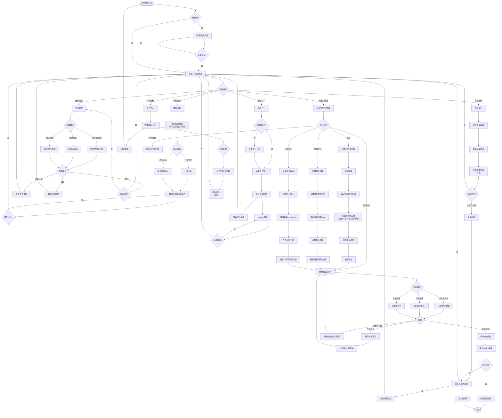
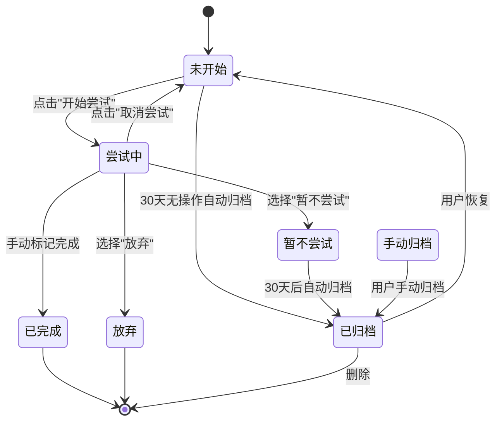
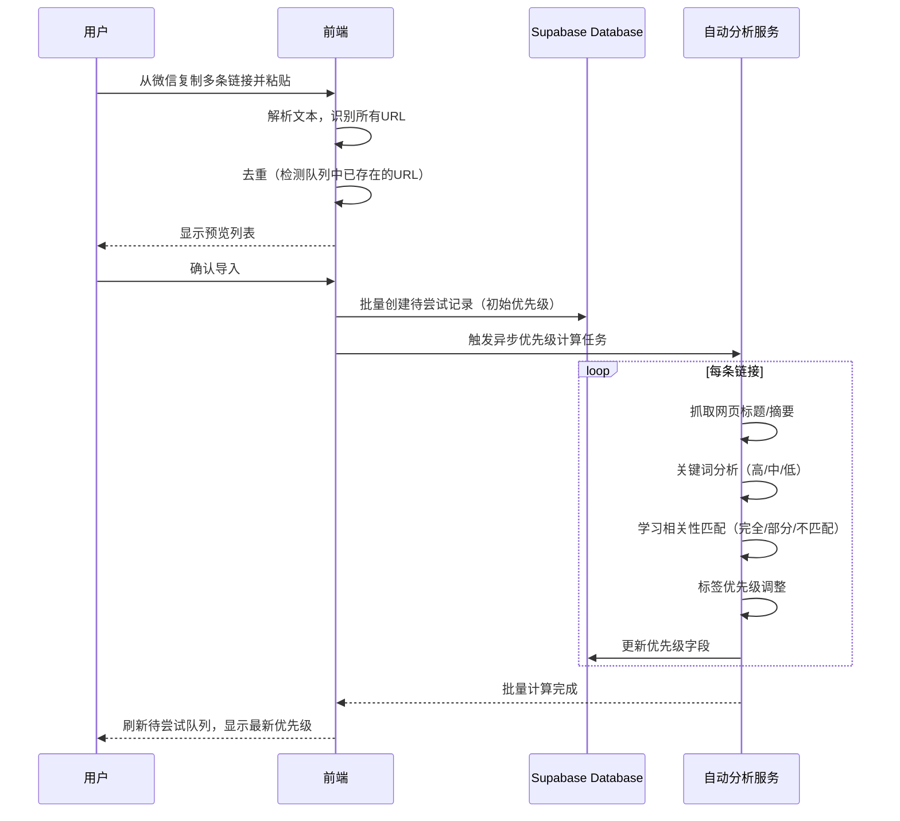

# 产品需求文档：TimePick (拾光) - 待尝试链接管理功能

## 1. 综述 (Overview)

### 1.1 项目背景与核心问题

**TimePick (拾光)** 是一个**个人知识管理与资源收集应用**，旨在帮助用户高效地收集、组织和管理各类数字资源（网页、文档、图片、视频），同时提供灵感速记和趣味性的抽签占卜功能。

**核心问题解决**：
- **信息分散**：用户在不同平台保存的链接、文件、笔记分散在各处，难以统一管理
- **组织混乱**：缺乏灵活的多维度分类方式（文件夹、标签、模块视图）
- **灵感流失**：突然的想法和灵感没有便捷的记录方式
- **情感连接**：缺乏趣味性的日常互动（抽签占卜）来增加用户粘性
- **⭐ 待尝试内容堆积**：用户在微信等渠道保存了大量"想去尝试"的链接（教程、工具、文章等），但无法导入、无法排优先级、缺乏系统性管理

### 1.2 核心业务流程 / 用户旅程地图

1. **阶段一：账户与身份** - 建立用户身份、设置个人资料（特别是生日，用于抽签功能）
2. **阶段二：资源收集** - 收集各类资源（网页/文档/图片/视频），建立内容库
3. **阶段三：组织管理** - 通过文件夹、标签、模块/章节多维度组织资源
4. **阶段四：灵感速记** - 随时记录想法，并可将灵感转化为正式资源
5. **阶段五：抽签占卜** - 基于生日抽取每日签文，AI 占卜聊天增加互动
6. **⭐ 阶段六：待尝试链接管理** - 从微信等渠道批量导入待尝试链接，智能优先级排序，系统化实践并沉淀为知识资产

### 1.3 Mermaid 图（流程/状态/时序）

#### 1.3.1 用户操作流（必填）



#### 1.3.2 状态机（待尝试链接生命周期）



#### 1.3.3 关键场景时序（批量导入与优先级计算）



---

## 2. 用户故事详述 (User Stories)

> **注**：阶段一至阶段五的现有功能用户故事详见 [PRD-001](./PRD-001-现有功能基线.md)。本文档重点记录**阶段六**的新增用户故事。

### 阶段六：待尝试链接管理

---

#### **US-14: 快速添加待尝试链接**
*   **价值陈述 (Value Statement)**:
    *   **作为** 用户
    *   **我希望** 能够快速录入一条待尝试链接，系统自动抓取标题并计算优先级
    *   **以便于** 快速收集而不打断当前工作流

*   **业务规则与逻辑 (Business Logic)**:
    1.  **前置条件**: 用户已登录，有可用存储空间
    2.  **操作流程 (Happy Path)**:
        - 用户点击"添加待尝试链接"按钮（主页"+"菜单或侧边栏"待尝试"入口）
        - 打开轻量级对话框（比"添加资源"对话框更简单）
        - 粘贴 URL，系统自动获取网页标题（可编辑）
        - 系统后台自动计算优先级并显示结果
        - 可选添加快速标签（🔥紧急、⭐必看、📚学习、🛠️工具、🎨设计、📝阅读、🔗有空调看、➕添加待尝试）
        - 点击"添加到队列"按钮
        - 关闭对话框，待尝试队列自动刷新
    3.  **异常处理 (Error Handling)**:
        - URL 格式错误：提示"请输入有效的网址"
        - 网络无法访问：提示"无法获取该网页，但仍可保存（仅标题需手动填写）"
        - 网页标题获取失败：输入框预填充 URL，用户需手动填写标题
        - 重复 URL：检测到已存在 → 询问"该链接已在队列中，是否跳转？"

    4.  **自动优先级计算规则**:
        - **初始分数**: 50 分（中优先级基准）
        - **关键词加分**:
          - 🔴 高优先级关键词（+30分）："速查"、"cheat sheet"、"必读"、"essential"、"入门"、"教程"、"tutorial"、"getting started"、"官方文档"、"official documentation"
          - 🟡 中优先级关键词（+10分）："指南"、"guide"、"最佳实践"、"best practices"、"技巧"、"tips"
          - 🟢 低优先级关键词（-20分）："可选"、"optional"、"扩展阅读"、"further reading"、"参考"、"reference"
        - **学习相关性加分**:
          - 完全匹配用户设置的"学习重点" → +20 分
          - 部分匹配 → +5 分
          - 不匹配 → -10 分
        - **标签联动调整**:
          - 选择"🔥 紧急" → 强制设为高优先级（用户可后续调整）
          - 选择"⭐ 必看" → 优先级 +20 分
          - 选择"🔗 有空再看" → 优先级 -10 分
        - **最终分值**:
          - ≥70 分 → 🔴 高
          - 40-69 分 → 🟡 中
          - <40 分 → 🟢 低

*   **验收标准 (Acceptance Criteria)**:
    *   **场景1: 成功添加链接（自动获取标题 + 推荐优先级）**
        *   **GIVEN** 用户在主页，已设置学习重点为"React"
        *   **WHEN** 用户粘贴 URL "https://react.dev/blog/react-19" 并点击"添加到队列"
        *   **THEN** 系统自动获取标题"React 19: 新特性介绍"；系统计算优先级为 🟡 中（标题含"React"匹配学习重点，但无高分关键词）；对话框关闭，待尝试队列新增该条目；显示成功提示"已添加到待尝试队列"
    *   **场景2: 高优先级链接（关键词 + 标签双重加分）**
        *   **GIVEN** 用户在添加链接对话框
        *   **WHEN** 用户粘贴一个"React 速查表"链接，并选择标签"🔥 紧急"
        *   **THEN** 关键词"速查"触发 +30 分；标签"紧急"强制设为高优先级；系统推荐优先级为 🔴 高；用户可后续手动调整为中/低
    *   **场景3: 重复链接提示**
        *   **GIVEN** 待尝试队列中已有链接 "https://example.com"
        *   **WHEN** 用户再次添加同一链接
        *   **THEN** 系统检测到重复，提示"该链接已在队列中（2025-02-10 添加），是否跳转查看？"，选项 A：[跳转到该链接]，选项 B：[仍要添加]（允许重复，但提示）
    *   **场景4: 网页无法访问但允许保存**
        *   **GIVEN** 用户粘贴一个需要 VPN 的链接
        *   **WHEN** 系统尝试获取标题失败
        *   **THEN** 显示警告"⚠️ 无法访问该网页，但可以保存"；标题输入框预填充 URL，用户可手动修改；用户点击"添加到队列"后仍可保存成功
    *   **场景5: 标签调整优先级**
        *   **GIVEN** 用户已添加一个链接（系统推荐 🟡 中）
        *   **WHEN** 用户编辑该条目，将标签改为"🔥 紧急"
        *   **THEN** 优先级自动更新为 🔴 高

---
*   **页面布局线框图 (ASCII Wireframe)**:
    ```text
    ┌────────────────────────────────────────┐
    │  添加待尝试链接                [×]   │
    ├────────────────────────────────────────┤
    │                                    │
    │  网页链接:                         │
    │  [https://_____________________]      │
    │                                    │
    │  标题:                             │
    │  [React 19 新特性完整指南________]    │
    │  ✅ 已自动获取                      │
    │                                    │
    │  系统推荐优先级: 🟡 中             │
    │  (关键词: 教程 +15 分 │ 相关性: 一般) │
    │                                    │
    │  标签: (可选)                      │
    │  [📚 学习] [🛠️ 工具] [+ 添加]     │
    │                                    │
    │  快速标签:                          │
    │  [🔥 紧急] [⭐ 必看] [📚 学习]    │
    │  [🛠️ 工具] [🎨 设计] [🔗 有空再看] │
    │  [➕ 添加待尝试]                    │
    │                                    │
    │        [取消]        [添加到队列]     │
    │                                    │
    └────────────────────────────────────────┘
    ```

---

#### **US-15: 批量导入链接（从微信）**
*   **价值陈述 (Value Statement)**:
    *   **作为** 用户
    *   **我希望** 能够一次性从微信复制多条链接并批量导入，系统自动识别所有 URL 并批量计算优先级
    *   **以便于** 快速清理微信"文件传输助手"中的链接堆积

*   **业务规则与逻辑 (Business Logic)**:
    1.  **前置条件**: 用户已登录
    2.  **操作流程 (Happy Path)**:
        - 用户进入侧边栏"待尝试"页面 → 点击"批量导入"按钮（主按钮位置）
        - 打开批量导入对话框，显示大文本框
        - 用户从微信复制多条消息，粘贴到输入框
        - 系统智能识别所有 URL（支持标准 URL、Markdown、微信卡片格式、纯文本混排）
        - 显示预览列表（表格形式）：序号 | 标题 | URL | 预估优先级 | 标签（可手动添加）
        - 用户可编辑标题、手动调整优先级、添加标签、删除不想导入的条目
        - 点击"全部导入到队列"按钮
        - 批量创建待尝试记录，后台异步计算优先级（避免卡顿）
    3.  **异常处理 (Error Handling)**:
        - 未识别到 URL：提示"未在粘贴内容中识别到链接，请检查格式"
        - 所有链接都重复：提示"所有链接都已在队列中，无需重复导入"
        - 部分链接重复：在预览列表中标记"已在队列中"，默认不勾选这些条目
        - 某些网页无法访问：正常显示，标题显示为"无法访问"（用户可手动编辑）
    4.  **批量导入限制**:
        - 单次最多支持 50 条链接（防止性能问题）
        - 如果粘贴超过 50 条，提示"单次最多导入 50 条，请分批导入"

*   **验收标准 (Acceptance Criteria)**:
    *   **场景1: 成功批量导入（从微信复制多条消息）**
        *   **GIVEN** 用户在微信文件传输助手中有 5 条链接消息
        *   **WHEN** 用户全选复制，粘贴到批量导入对话框，点击"全部导入"
        *   **THEN** 系统识别 5 条 URL；自动获取所有标题（可访问的网页）；计算优先级（🔴2条 / 🟡2条 / 🟢1条）；对话框关闭，待尝试队列新增 5 条记录；显示成功提示"已导入 5 条链接"
    *   **场景2: 智能去重（部分链接已存在）**
        *   **GIVEN** 用户待尝试队列中已有链接 A 和 B
        *   **WHEN** 用户从微信复制包含 A、B、C 三条链接的内容
        *   **THEN** 预览列表显示 3 条；A 和 B 标记为"已在队列中"，默认不勾选；仅 C 被勾选，点击导入后只新增 C
    *   **场景3: 手动编辑标题和优先级**
        *   **GIVEN** 用户粘贴了一批链接，系统识别出 8 条
        *   **WHEN** 用户将第 3 条的标题从"无法访问"改为"AI 工具集合"，优先级从 🟢 改为 🔴
        *   **THEN** 导入后的待尝试记录显示用户修改后的标题和优先级
    *   **场景4: 超过限制提示**
        *   **GIVEN** 用户从微信复制了 60 条链接消息
        *   **WHEN** 用户粘贴到批量导入对话框
        *   **THEN** 系统识别 60 条 URL；显示提示"单次最多导入 50 条，已为您选取前 50 条"；预览列表仅显示前 50 条
    *   **场景5: 无 URL 识别**
        *   **GIVEN** 用户复制了纯文本（无链接）
        *   **WHEN** 用户粘贴到批量导入对话框
        *   **THEN** 显示错误提示"未在粘贴内容中识别到链接，请检查格式"

---
*   **页面布局线框图 (ASCII Wireframe)**:
    ```text
    ┌────────────────────────────────────────────┐
    │  批量导入链接                     [×]  │
    ├────────────────────────────────────────────┤
    │                                      │
    │  从微信复制多条消息，粘贴到下方：        │
    │  ┌────────────────────────────────────┐ │
    │  │ [粘贴微信消息到这里...]            │ │
    │  │                                 │ │
    │  │                                 │ │
    │  │                                 │ │
    │  │                                 │ │
    │  └────────────────────────────────────┘ │
    │                                      │
    │  已识别 12 条链接 | 重复 2 条          │
    │                                      │
    │  ──── 预览列表 (可编辑) ────         │
    │                                      │
    │  ☑ │ 标题          │ URL      │ 优先级 │
    │  ────┼──────────────┼─────────┼───────│
    │  ☑ │ React 19 教程 │ react..│ 🟡 中  │
    │    │               │ .dev    │ [+编辑] │
    │  ☑ │ TypeScript    │ typesc..│ 🔴 高  │
    │    │ 速查表       │ lang.. │        │
    │  ☑ │ Figma 技巧    │ figma.. │ 🟢 低  │
    │    │               │ .com    │        │
    │  ☐ │ (已在队列)    │ old..   │ -      │
    │  ☑ │ UI 设计指南    │ design..│ 🟡 中  │
    │    │               │ .com    │        │
    │                                      │
    │  ─────────────────────────────────────── │
    │                                      │
    │  [取消预览]  [全部导入到队列]         │
    │                                      │
    └────────────────────────────────────────────┘
    ```

---

#### **US-16: 设置学习重点与相关性优先级**
*   **价值陈述 (Value Statement)**:
    *   **作为** 用户
    *   **我希望** 能够设置当前的学习重点（如"React"、"UI 设计"），系统自动识别与学习重点相关的链接，提升优先级
    *   **以便于** 优先学习最相关的资源

*   **业务规则与逻辑 (Business Logic)**:
    1.  **前置条件**: 用户已登录
    2.  **操作流程 (Happy Path)**:
        - 用户点击"设置学习重点"按钮（待尝试队列页面顶部或个人资料页面）
        - 打开学习重点设置对话框
        - 添加学习重点（如"React"、"TypeScript"、"UI 设计"）
        - 每个学习重点可设置**权重**（默认 1.0，范围 0.5-2.0）
          - 权重 2.0：最优先，相关性匹配时优先级 +40 分
          - 权重 1.0：正常，相关性匹配时优先级 +20 分
          - 权重 0.5：次要，相关性匹配时优先级 +10 分
        - 为每个学习重点自定义**同义词**（如 React → React.js/ReactJS/前端框架）
        - 点击"保存"或"重新计算所有优先级"按钮
        - 系统重新分析所有"未开始"状态的链接并更新优先级
    3.  **学习重点管理**:
        - 显示所有已设置的学习重点（标签形式）
        - 每个标签可编辑权重、自定义同义词、暂停或删除
        - 支持"暂停"某个学习重点（暂停后不计入优先级计算）
    4.  **相关性匹配规则**:
        - **完全匹配**（优先级 +40 分 * 权重）：网页标题包含学习重点关键词（完整匹配）
        - **部分匹配**（优先级 +10 分 * 权重）：网页标题包含学习重点的关联词（需维护同义词库）
        - **不匹配**（优先级 -10 分）：网页标题与所有学习重点无关（惩罚力度较小）
    5.  **优先级重新计算**:
        - 触发时机：用户修改学习重点时 → 提示"是否重新计算所有链接的优先级？"；用户点击"重新计算"按钮；每天自动重新计算一次（可选，后台静默执行）
        - 重新计算范围：仅影响"未开始"状态的链接；"尝试中"和"已完成"的链接优先级不变

*   **验收标准 (Acceptance Criteria)**:
    *   **场景1: 设置学习重点并重新计算**
        *   **GIVEN** 用户待尝试队列中有 20 条未开始的链接
        *   **WHEN** 用户添加学习重点"React"（权重 2.0），点击"重新计算所有优先级"
        *   **THEN** 系统分析所有链接；标题含"React"的 3 条链接优先级提升（如从 🟡 变为 🔴）；显示提示"已更新 3 条链接的优先级"；待尝试队列自动刷新排序
    *   **场景2: 暂停学习重点**
        *   **GIVEN** 用户设置了"React"（权重 2.0）和"Vue"（权重 1.0）
        *   **WHEN** 用户暂时不学 React，点击"暂停"React 学习重点
        *   **THEN** React 标签显示"已暂停"标记；重新计算时，React 相关链接不再获得优先级加成；Vue 相关链接优先级正常计算
    *   **场景3: 调整权重影响优先级**
        *   **GIVEN** 用户有学习重点"UI 设计"（权重 1.0），相关链接优先级为 🟡 中
        *   **WHEN** 用户将"UI 设计"权重调整为 2.0，点击"重新计算"
        *   **THEN** UI 设计相关链接优先级从 🟡 变为 🔴
    *   **场景4: 多学习重点综合匹配**
        *   **GIVEN** 用户设置了"React"（2.0）和"TypeScript"（1.0）
        *   **WHEN** 有一条链接标题为"React + TypeScript 全栈开发"
        *   **THEN** 同时匹配两个学习重点；优先级加成：(40 * 2.0) + (20 * 1.0) = 100 分；最终优先级为 🔴 高
    *   **场景5: 删除学习重点**
        *   **GIVEN** 用户设置了"Python"学习重点
        *   **WHEN** 用户学完 Python，删除该学习重点
        *   **THEN** 显示确认提示"删除后，Python 相关链接将失去优先级加成，是否确认？"；确认后，Python 从学习重点列表移除；已有链接的优先级保持不变（除非用户点击"重新计算"）

---
*   **页面布局线框图 (ASCII Wireframe)**:
    ```text
    ┌────────────────────────────────────────────┐
    │  设置学习重点                     [×]  │
    ├────────────────────────────────────────────┤
    │                                      │
    │  添加学习重点:                        │
    │  [输入关键词，如 React、UI 设计__]      │
    │                                      │
    │  当前学习重点: (已设置 3 个)           │
    │                                      │
    │  ┌──────────────────────────────────┐   │
    │  │ React                   权重: 2.0 │   │
    │  │ [编辑权重] [暂停] [删除]            │   │
    │  └──────────────────────────────────┘   │
    │  (完全匹配 +40分 │ 部分匹配 +10分)   │
    │                                      │
    │  ┌──────────────────────────────────┐   │
    │  │ UI 设计                 权重: 1.0 │   │
    │  │ [编辑权重] [暂停] [删除]            │   │
    │  └──────────────────────────────────┘   │
    │  (完全匹配 +20分 │ 部分匹配 +5分)    │
    │                                      │
    │  ┌──────────────────────────────────┐   │
    │  │ TypeScript             权重: 0.5 │   │
    │  │ [编辑权重] [暂停] [删除]            │   │
    │  └──────────────────────────────────┘   │
    │  (完全匹配 +10分 │ 部分匹配 +2.5分)  │
    │                                      │
    │  ────────────────────────────────────   │
    │                                      │
    │  [重新计算所有优先级]  [保存]         │
    │  (会重新分析未开始的链接)               │
    │                                      │
    └────────────────────────────────────────────┘
    ```

---

#### **US-17: 手动调整优先级**
*   **价值陈述 (Value Statement)**:
    *   **作为** 用户
    *   **我希望** 能够手动调整链接的优先级
    *   **以便于** 在自动推荐不准确时进行微调

*   **业务规则与逻辑 (Business Logic)**:
    1.  **前置条件**: 用户已登录，待尝试队列中至少有一条链接
    2.  **操作流程 (Happy Path)**:
        - **方式 A：拖拽排序**（直观、快速）
          - 在待尝试队列中，用户可拖拽条目调整顺序
          - 🔴 高优先级分组内可拖拽；🟡 中优先级分组内可拖拽；🟢 低优先级分组内可拖拽
          - 不支持跨分组拖拽（如从高拖到中，应使用"设置优先级"功能）
        - **方式 B：直接点击优先级图标**（最快捷）
          - 每个条目右侧显示 🔴/🟡/🟢 图标
          - 点击图标直接切换优先级：🔴 → 🟡 → 🟢 → 🔴（循环切换）
          - 切换后条目自动移到对应分组
        - **方式 C：编辑对话框**（精确控制）
          - 点击条目的"编辑"按钮
          - 对话框中显示优先级选择器（🔴高 / 🟡中 / 🟢低）
          - 还可以手动设置"队列位置"（如"第 3 位"）
          - 保存后更新
    3.  **锁定优先级**（防止自动覆盖）:
        - 用户可以"锁定"某个条目的优先级
        - 锁定后，即使重新计算学习重点，该条目优先级不变
        - 锁定标记：🔒 图标
        - 场景：你认为某个链接非常重要，但系统推荐为 🟡 中，可手动改为 🔴 并锁定
    4.  **批量操作**（暂时不做）:
        - 未来版本支持多选后批量调整优先级

*   **验收标准 (Acceptance Criteria)**:
    *   **场景1: 点击图标快速切换优先级**
        *   **GIVEN** 用户在待尝试队列，有一条 🟡 中优先级链接
        *   **WHEN** 用户点击该条目的 🟡 图标
        *   **THEN** 优先级变为 🔴 高（图标变为 🔴）；条目自动移动到"高优先级"分组顶部；显示提示"已设为高优先级"
    *   **场景2: 拖拽排序（同分组内）**
        *   **GIVEN** 用户在高优先级分组有 3 条链接（A 在第 1 位，B 在第 2 位）
        *   **WHEN** 用户拖拽 B 到 A 上方
        *   **THEN** B 变为第 1 位，A 变为第 2 位
    *   **场景3: 拖拽跨分组（不支持）**
        *   **GIVEN** 用户有一条 🟡 中优先级链接
        *   **WHEN** 用户尝试拖拽到 🔴 高优先级分组
        *   **THEN** 系统阻止拖拽，显示提示"请使用优先级图标切换分组"
    *   **场景4: 锁定优先级防止自动覆盖**
        *   **GIVEN** 用户将某条链接设为 🔴 高并锁定，然后修改学习重点
        *   **WHEN** 用户点击"重新计算所有优先级"
        *   **THEN** 其他链接正常重新计算；该锁定链接优先级保持 🔴 高不变；显示提示"已跳过 1 条锁定链接"

---
*   **页面布局线框图 (ASCII Wireframe)**:
    ```text
    ┌────────────────────────────────────────────┐
    │  待尝试队列页面                      │
    ├────────────────────────────────────────────┤
    │                                      │
    │  🔴 高优先级 (6 条)                  │
    │                                      │
    │  ┌──────────────────────────────────┐  │
    │  │ 🔒 React 19 新特性指南  [🔴▼]    │  │
    │  │   [React] [必读]  队列第 1 位    │  │
    │  │   [开始尝试] [编辑] [删除]        │  │
    │  └──────────────────────────────────┘  │
    │         ↑ 可拖拽                        │
    │                                      │
    │  ┌──────────────────────────────────┐  │
    │  │   TypeScript 速查表      [🟡▼]    │  │
    │  │   [TypeScript] [工具]            │  │
    │  │   [开始尝试] [编辑] [删除]        │  │
    │  └──────────────────────────────────┘  │
    │         ↑ 可拖拽                        │
    │                                      │
    └────────────────────────────────────────────┘
    ```

---

#### **US-18: 待尝试队列与实践流程**
*   **价值陈述 (Value Statement)**:
    *   **作为** 用户
    *   **我希望** 按优先级查看所有待尝试链接，点击"开始尝试"后跳转到链接并标记状态，完成后手动标记并评分
    *   **以便于** 有序地实践和跟踪进度

*   **业务规则与逻辑 (Business Logic)**:
    1.  **前置条件**: 用户已登录，待尝试队列中至少有一条链接
    2.  **队列展示方式**:
        - **视图模式**（用户可切换）:
          - **模式 A：优先级分组**（默认）：🔴 高优先级 / 🟡 中优先级 / 🟢 低优先级，每个分组内按队列顺序排列
          - **模式 B：队列顺序**（单一列表）：第 1 位 / 第 2 位 / 第 3 位...所有链接按队列顺序，不分组，显示优先级图标但无分组标题
          - **模式 C：仅显示未开始**（聚焦视图）：默认显示所有（未开始 + 尝试中），可切换为"仅显示未开始"（隐藏"尝试中"的条目）
        - **筛选器**: 按标签筛选（如仅显示 [React] 标签的链接）；按状态筛选（未开始 / 尝试中 / 已完成 / 暂不尝试）；按时间筛选（今天添加 / 本周添加 / 更早）
        - **排序器**: 优先级 + 队列顺序（默认）；添加时间（最新在前）；截止日期（如有）
    3.  **开始尝试流程**:
        - 用户点击条目的"开始尝试"按钮
        - 打开新标签页，跳转到链接
        - 在后台标记状态为"尝试中"
        - 待尝试队列页面实时刷新：该条目从"未开始"分组移到"尝试中"分组；显示"尝试中"标记（⏳ 图标）；显示"开始时间"（如"10 分钟前开始"）
        - 允许同时"尝试中"多个链接
    4.  **手动完成流程**:
        - 用户点击条目的"标记完成"按钮（"尝试中"状态才显示此按钮）
        - 打开完成对话框，用户选择：
          - 标记为：✅ 已完成 / ⏸️ 暂不尝试 / ❌ 放弃（不实用）
          - 有用程度评分：1-5 星（必填）
          - 备注：用户填写的评语（可选）
          - 是否转为正式资源：勾选框
        - 点击"确认完成"后，条目从"尝试中"移到"已完成"（或"暂不尝试"/"放弃"）
        - 在待尝试队列页面默认隐藏（可通过筛选器查看已完成）
        - 保存评分和备注（可用于未来参考）
        - 如果选择"转为正式资源"，自动创建资源记录并关联
    5.  **状态流转**:
        - 未开始 → 尝试中 → 已完成 / 暂不尝试 / 放弃
        - 可以返回未开始（如点击"取消尝试"）

*   **验收标准 (Acceptance Criteria)**:
    *   **场景1: 开始尝试（新标签页跳转 + 状态标记）**
        *   **GIVEN** 用户在待尝试队列，有一条"React 19 新特性"链接（未开始）
        *   **WHEN** 用户点击"开始尝试"按钮
        *   **THEN** 新标签页打开并跳转到链接；待尝试队列页面刷新；该条目状态变为"尝试中"（⏳ 图标）；显示"刚刚开始"；条目移动到"尝试中"分组
    *   **场景2: 标记完成并评分**
        *   **GIVEN** 用户有一条"尝试中"状态的链接
        *   **WHEN** 用户点击"标记完成"，选择"✅ 已完成"，评分 5 星，备注"很有用"，点击"确认完成"
        *   **THEN** 条目从"尝试中"移到"已完成"；在待尝试队列页面默认隐藏（需切换筛选器查看）；已完成列表显示：评分 5 星、备注"很有用"；显示提示"已完成并评分"
    *   **场景3: 标记为"暂不尝试"**
        *   **GIVEN** 用户打开链接后，发现内容暂时不需要
        *   **WHEN** 用户点击"标记完成"，选择"⏸️ 暂不尝试"，点击"确认"
        *   **THEN** 条目状态变为"暂不尝试"（⏸️ 图标）；在"未开始"筛选器中隐藏；在"暂不尝试"筛选器中可查看；用户可以随时点击"重新尝试"回到"未开始"
    *   **场景4: 取消尝试（返回未开始）**
        *   **GIVEN** 用户点击"开始尝试"后，发现链接打不开
        *   **WHEN** 用户点击"取消尝试"按钮
        *   **THEN** 条目状态从"尝试中"回到"未开始"；移回原来的优先级分组；不记录"开始时间"
    *   **场景5: 同时尝试多个链接**
        *   **GIVEN** 用户有条目 A 和 B 都是"尝试中"状态
        *   **WHEN** 用户再点击条目 C 的"开始尝试"
        *   **THEN** 条目 C 也变为"尝试中"；"尝试中"分组显示 3 条（A、B、C）；每条显示各自的"开始时间"
    *   **场景6: 转为正式资源**
        *   **GIVEN** 用户完成了一条链接并选择"转为正式资源"
        *   **WHEN** 用户点击"确认完成"
        *   **THEN** 系统自动创建资源记录；标题、链接、标签、备注从待尝试记录复制；显示提示"已添加到资源库"；用户可在资源库中查看该资源

---
*   **页面布局线框图 (ASCII Wireframe)**:
    ```text
    ┌────────────────────────────────────────────┐
    │  待尝试队列                共 24 条      │
    ├────────────────────────────────────────────┤
    │                                      │
    │  🔍 搜索  [标签: 全部 ▼]  [视图 ▼]  │
    │  [筛选: 全部 ▼]  [排序: 优先级 ▼]    │
    │                                      │
    │  ───────── 🔴 高优先级 (6 条) ───────│
    │                                      │
    │  ┌──────────────────────────────────┐  │
    │  │ 🔒 React 19 新特性指南  [🔴▼]    │  │
    │  │   [React] [必读]  第 1 位         │  │
    │  │   [开始尝试] [编辑] [删除]        │  │
    │  └──────────────────────────────────┘  │
    │                                      │
    │  ───────── 🟡 中优先级 (15 条) ──────│
    │  │ ...                                │
    │                                      │
    │  ───────── 🟢 低优先级 (3 条) ───────│
    │  │ ...                                │
    │                                      │
    │  ───────── ⏳ 尝试中 (2 条) ─────────│
    │                                      │
    │  ┌──────────────────────────────────┐  │
    │  │ ⏳ UI 设计趋势 2025   [🟡▼]      │  │
    │  │   [设计]  [开始 10 分钟前]        │  │
    │  │   [标记完成] [取消尝试] [编辑]     │  │
    │  └──────────────────────────────────┘  │
    │                                      │
    └────────────────────────────────────────────┘
    ```

---

#### **US-19: 转化为正式资源或归档**
*   **价值陈述 (Value Statement)**:
    *   **作为** 用户
    *   **我希望** 完成的待尝试链接可以一键转化为正式资源，或归档保留（但不占用资源库空间）
    *   **以便于** 将"待尝试内容"沉淀为"知识资产"

*   **业务规则与逻辑 (Business Logic)**:
    1.  **前置条件**: 用户已登录，待尝试队列中至少有一条"已完成"或"暂不尝试"状态的链接
    2.  **触发方式**:
        - **方式 A：标记完成时选择**（主要方式）：在"完成对话框"中已有勾选框"是否转为正式资源?"，勾选后，标记完成的同时创建资源
        - **方式 B：已完成列表中转化**（补充方式）：在已完成列表，点击某条目的"[转为资源]"按钮，弹出确认对话框，快速创建资源
    3.  **转化逻辑**:
        - **自动填充信息**：从待尝试记录复制以下信息到资源：标题（链接标题）、URL（直接填充到资源 URL 字段）、标签（待尝试的标签转为资源的标签）、备注（用户填写的"有用程度备注"）、所属文件夹（询问用户选择或默认"未分类"）
        - **资源类型**：自动识别为"网页"类型（section），用户可以在转化对话框中修改类型
        - **评分转备注**：用户对链接的评分（1-5 星）会添加到资源备注中，格式："⭐⭐⭐⭐⭐ (5/5) - 原评语：这个教程很实用"
        - **转化后的关联**：资源创建后，待尝试记录中保存关联字段`converted_to_resource_id`，点击"查看资源"按钮可直接跳转到该资源
    4.  **归档逻辑**:
        - **归档 vs 删除**：归档（保留在数据库中，状态为"已归档"，不在待尝试队列显示）；删除（从数据库彻底删除）
        - **归档条件**：用户标记为"暂不尝试"的链接，30 天后自动归档；用户手动选择"归档"（在已完成列表）
        - **归档后的访问**：在待尝试队列页面，有"查看归档"筛选器；归档的条目只读，不能编辑或开始尝试；可以"恢复"（从归档回到"未开始"）
    5.  **删除逻辑**:
        - 用户可以删除待尝试记录
        - 删除前需确认
        - 删除后不可恢复（除非有数据库备份）

*   **验收标准 (Acceptance Criteria)**:
    *   **场景1: 标记完成时转为资源**
        *   **GIVEN** 用户完成了一条链接，评分 5 星，备注"很有用"
        *   **WHEN** 用户在完成对话框勾选"转为正式资源"，选择文件夹"前端学习"，点击"确认完成"
        *   **THEN** 待尝试记录状态变为"已完成"；资源库新增一条资源（标题、URL、标签自动填充）；资源备注包含"⭐⭐⭐⭐⭐ (5/5) - 原评语：很有用"；资源所属文件夹为"前端学习"；显示提示"已完成并添加到资源库"
    *   **场景2: 已完成列表中转为资源**
        *   **GIVEN** 用户有一条"已完成"记录，之前未转化
        *   **WHEN** 用户点击"[转为资源]"按钮，确认转化对话框
        *   **THEN** 创建资源记录（信息自动填充）；待尝试记录保存关联字段`converted_to_resource_id`；已完成列表中该条目显示"[查看资源]"按钮
    *   **场景3: 点击"查看资源"跳转**
        *   **GIVEN** 用户有一条已转化的待尝试记录
        *   **WHEN** 用户点击"[查看资源]"按钮
        *   **THEN** 跳转到资源详情页；显示该资源的完整信息
    *   **场景4: 手动归档**
        *   **GIVEN** 用户有一条"暂不尝试"的记录
        *   **WHEN** 用户点击"[归档]"按钮，确认归档
        *   **THEN** 记录状态变为"已归档"；从"暂不尝试"列表移除；在"归档"列表可查看；显示提示"已归档"
    *   **场景5: 自动归档（30 天后）**
        *   **GIVEN** 用户有一条"暂不尝试"记录，状态已保持 30 天
        *   **WHEN** 系统执行自动归档任务（后台定时任务）
        *   **THEN** 记录状态变为"已归档"；不发送通知（静默归档）
    *   **场景6: 恢复归档记录**
        *   **GIVEN** 用户在归档列表有一条记录
        *   **WHEN** 用户点击"[恢复]"按钮
        *   **THEN** 记录状态变为"未开始"；从归档列表移除；回到待尝试队列（恢复到原来的优先级）
    *   **场景7: 删除归档记录**
        *   **GIVEN** 用户在归档列表有一条记录
        *   **WHEN** 用户点击"[删除]"按钮，确认删除
        *   **THEN** 显示确认提示"删除后无法恢复，是否确认？"；确认后从数据库彻底删除；归档列表不再显示该记录

---
*   **页面布局线框图 (ASCII Wireframe)**:
    ```text
    ┌────────────────────────────────────────────┐
    │  已完成列表                共 18 条      │
    ├────────────────────────────────────────────┤
    │                                      │
    │  ┌──────────────────────────────────┐  │
    │  │ ✅ React 19 新特性指南           │  │
    │  │   ⭐⭐⭐⭐⭐ (5/5)            │  │
    │  │   [已完成] 2025-02-14            │  │
    │  │   "这个教程很实用，学到了 Hooks"  │  │
    │  │   [查看资源] [转为资源] [归档]    │  │
    │  └──────────────────────────────────┘  │
    │                                      │
    │  ┌──────────────────────────────────┐  │
    │  │ ✅ TypeScript 速查表            │  │
    │  │   ⭐⭐⭐ (3/5)                 │  │
    │  │   [已完成] 2025-02-13            │  │
    │  │   [转为资源] [归档] [删除]        │  │
    │  └──────────────────────────────────┘  │
    │                                      │
    └────────────────────────────────────────────┘
    ```

---

## 3. 附录

### 3.1 数据库表结构（核心表 - 新增/修改）

**新增表：try_queue_links** (待尝试链接)
- id (UUID, PK)
- user_id (UUID, FK)
- url (文本, NOT NULL)
- title (文本)
- priority_score (整数) - 优先级原始分数
- priority_level (文本) - 'high' / 'medium' / 'low'
- queue_position (整数) - 队列位置（第几位）
- is_priority_locked (布尔) - 是否锁定优先级
- tags (文本[], ARRAY) - 标签数组
- status (文本) - 'unstarted' / 'trying' / 'completed' / 'deferred' / 'abandoned' / 'archived'
- start_time (时间戳, 可选) - 开始尝试时间
- complete_time (时间戳, 可选) - 完成时间
- rating (整数, 可选) - 评分 1-5
- notes (文本, 可选) - 用户备注
- converted_to_resource_id (UUID, FK, 可选) - 转化的资源ID
- archived_at (时间戳, 可选) - 归档时间
- created_at (时间戳)
- updated_at (时间戳)

**新增表：learning_focus** (学习重点)
- id (UUID, PK)
- user_id (UUID, FK)
- name (文本, NOT NULL) - 学习重点名称（如"React"）
- weight (浮点数) - 权重 0.5/1.0/2.0
- synonyms (文本[], ARRAY) - 同义词数组（如["React.js", "ReactJS", "前端框架"]）
- is_paused (布尔) - 是否暂停
- created_at (时间戳)
- updated_at (时间戳)

**修改表：profiles** (用户资料)
- 新增字段：default_try_queue_folder_id (UUID, FK, 可选) - 转化资源时的默认文件夹

### 3.2 技术栈

**前端**: React 19.1.1 + TypeScript + Vite + Tailwind CSS + Radix UI + shadcn/ui
**后端**: Supabase (PostgreSQL + Auth + Storage + Edge Functions)
**新增技术**:
- 后台异步任务：Supabase Edge Functions (批量优先级计算)
- 网页内容抓取：Supabase Edge Function (调用目标 URL 获取 title/meta description)

### 3.3 关键配置

**优先级计算阈值**:
- 🔴 高优先级: ≥70 分
- 🟡 中优先级: 40-69 分
- 🟢 低优先级: <40 分

**自动归档规则**:
- "暂不尝试"状态 30 天后自动归档
- 后台定时任务每日凌晨 2:00 执行

**批量导入限制**:
- 单次最多 50 条链接
- 超过 50 条提示"请分批导入"

### 3.4 角色定义

**Collector (收藏者)**: 偏向收集和整理资源（当前已隐藏 UI 角色，逻辑保留）
**Searcher (搜寻者)**: 偏向搜索和检索资源（当前已隐藏 UI 角色，逻辑保留）

---

**文档版本**: 2.0
**生成日期**: 2026-02-15
**PRD 状态**: 新增功能待尝试链接管理（待开发）
**关联文档**: [PRD-001 现有功能基线](./PRD-001-现有功能基线.md)
