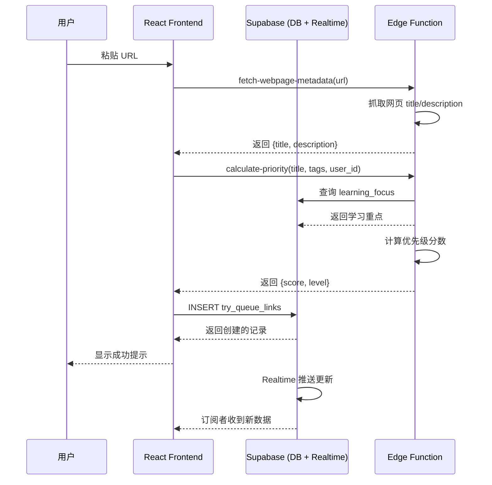
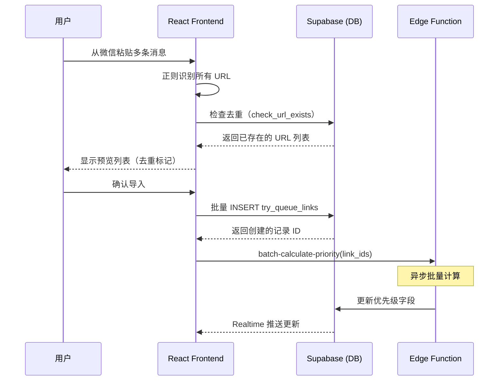

# TimePick 技术方案文档

> **项目**: 待尝试链接管理功能（PRD-002 阶段六）
>
> **版本**: 2.0
>
> **日期**: 2026-02-15
>
> **作者**: Claude (Sonnet 4.5)

---

## 1. 架构设计

### 1.1 整体架构

TimePick 采用**前后端分离架构**，基于 Supabase 作为 BaaS（Backend as a Service）平台。

```
┌─────────────────────────────────────────────────────────────┐
│                   用户端（浏览器）                        │
│  ┌───────────────────────────────────────────────────────┐ │
│  │  React 19.1.1 + TypeScript 5.9.2 + Vite 7.1.4  │ │
│  │  ┌──────────────────────────────────────────────┐   │ │
│  │  │  UI Components (shadcn/ui + Tailwind)     │   │ │
│  │  │  - TryQueue 页面                          │   │ │
│  │  │  - AddTryQueueLinkDialog                 │   │ │
│  │  │  - BatchImportDialog                     │   │ │
│  │  │  - LearningFocusDialog                   │   │ │
│  │  │  - CompleteTryQueueDialog               │   │ │
│  │  └──────────────────────────────────────────────┘   │ │
│  │  ┌──────────────────────────────────────────────┐   │ │
│  │  │  State Management                        │   │ │
│  │  │  - React Context (Auth)                  │   │ │
│  │  │  - TanStack React Query 5.86.0          │   │ │
│  │  └──────────────────────────────────────────────┘   │ │
│  └───────────────────────────────────────────────────────┘ │
└─────────────────────────────────────────────────────────────┘
                          ↕ HTTPS / WebSocket
┌─────────────────────────────────────────────────────────────┐
│                    Supabase 平台                        │
│  ┌───────────────────────────────────────────────────────┐ │
│  │  Supabase Auth (JWT)                            │ │
│  └───────────────────────────────────────────────────────┘ │
│  ┌───────────────────────────────────────────────────────┐ │
│  │  PostgreSQL Database                               │ │
│  │  - try_queue_links 表                             │ │
│  │  - learning_focus 表                               │ │
│  │  - Realtime (数据变更订阅)                          │ │
│  └───────────────────────────────────────────────────────┘ │
│  ┌───────────────────────────────────────────────────────┐ │
│  │  Supabase Storage (可选)                          │ │
│  └───────────────────────────────────────────────────────┘ │
│  ┌───────────────────────────────────────────────────────┐ │
│  │  Supabase Edge Functions (Deno)                  │ │
│  │  - fetch-webpage-metadata                        │ │
│  │  - calculate-priority                            │ │
│  │  - batch-calculate-priority                       │ │
│  └───────────────────────────────────────────────────────┘ │
└─────────────────────────────────────────────────────────────┘
```

### 1.2 数据流设计

#### 流程 1：添加待尝试链接



#### 流程 2：批量导入



---

## 2. 技术选型

### 2.1 前端技术栈

| 技术 | 版本 | 用途 | 选择理由 |
|------|------|------|----------|
| **React** | 19.1.1 | UI 框架 | 最新稳定版，支持 Compiler 优化 |
| **TypeScript** | 5.9.2 | 类型安全 | 减少运行时错误，提升开发效率 |
| **Vite** | 7.1.4 | 构建工具 | 快速冷启动，HMR 流畅 |
| **TanStack Query** | 5.86.0 | 数据获取 | 缓存、自动重试、Realtime 集成 |
| **Tailwind CSS** | 3.4.17 | 样式框架 | 快速开发，响应式设计 |
| **shadcn/ui** | 最新 | UI 组件库 | 基于 Radix UI，可定制性强 |
| **Lucide React** | 最新 | 图标库 | 轻量、Tree-shaking |
| **@dnd-kit/core** | 最新 | 拖拽库 | 性能优秀，支持触摸设备 |
| **React Hook Form** | 7.62.0 | 表单管理 | 性能优化，与 Zod 集成 |
| **Zod** | 4.1.5 | Schema 验证 | 类型推断，运行时验证 |

### 2.2 后端技术栈

| 技术 | 版本 | 用途 | 选择理由 |
|------|------|------|----------|
| **Supabase** | 2.x | BaaS 平台 | 已集成，降低开发成本 |
| **PostgreSQL** | 15.x | 关系数据库 | 支持复杂查询、JSON 类型 |
| **Supabase Edge Functions** | Deno | Serverless | 轻量级任务，全球边缘部署 |
| **pg_cron** | - | 定时任务 | 自动归档功能 |

### 2.3 新增依赖（需安装）

```json
{
  "dependencies": {
    "@dnd-kit/core": "^6.x.x",
    "@dnd-kit/sortable": "^8.x.x",
    "@dnd-kit/utilities": "^3.x.x"
  }
}
```

---

## 3. 数据库设计

### 3.1 表结构概览

| 表名 | 用途 | 记录数预估 |
|------|------|-----------|
| `try_queue_links` | 待尝试链接主表 | 1000+ / 用户 |
| `learning_focus` | 学习重点配置 | 5-10 / 用户 |
| `profiles` (修改) | 用户资料（新增字段） | 1 / 用户 |

### 3.2 详细表结构

#### try_queue_links（待尝试链接）

| 字段名 | 类型 | 约束 | 说明 |
|--------|------|--------|------|
| `id` | UUID | PK | 主键 |
| `user_id` | UUID | FK, NOT NULL | 用户关联 |
| `url` | TEXT | NOT NULL | 链接地址 |
| `title` | TEXT | - | 网页标题 |
| `description` | TEXT | - | 网页描述 |
| `priority_score` | INTEGER | DEFAULT 50 | 优先级原始分数（0-100+）|
| `priority_level` | TEXT | CHECK ('high','medium','low') | 优先级等级 |
| `queue_position` | INTEGER | - | 队列位置（第几位）|
| `is_priority_locked` | BOOLEAN | DEFAULT false | 是否锁定优先级 |
| `tags` | TEXT[] | DEFAULT '{}' | 标签数组 |
| `status` | TEXT | CHECK (6种状态) | 状态枚举 |
| `start_time` | TIMESTAMPTZ | - | 开始尝试时间 |
| `complete_time` | TIMESTAMPTZ | - | 完成时间 |
| `archived_at` | TIMESTAMPTZ | - | 归档时间 |
| `rating` | INTEGER | CHECK (1-5) | 评分 |
| `notes` | TEXT | - | 用户备注 |
| `converted_to_resource_id` | UUID | FK | 关联资源 ID |

#### learning_focus（学习重点）

| 字段名 | 类型 | 约束 | 说明 |
|--------|------|--------|------|
| `id` | UUID | PK | 主键 |
| `user_id` | UUID | FK, NOT NULL | 用户关联 |
| `name` | TEXT | NOT NULL | 学习重点名称 |
| `weight` | NUMERIC(2,1) | CHECK (0.5-2.0) | 权重 |
| `synonyms` | TEXT[] | DEFAULT '{}' | 同义词数组 |
| `is_paused` | BOOLEAN | DEFAULT false | 是否暂停 |

### 3.3 索引设计

| 索引名 | 字段 | 用途 |
|--------|------|------|
| `idx_try_queue_links_user_id` | `user_id` | 按用户查询 |
| `idx_try_queue_links_status` | `status` | 按状态筛选 |
| `idx_try_queue_links_user_status` | `user_id, status` | 组合查询（最常用）|
| `idx_try_queue_links_user_priority` | `user_id, priority_level, queue_position` | 队列排序 |
| `idx_try_queue_links_url` | `url` | 去重检测 |

---

## 4. 接口设计

### 4.1 Edge Function: fetch-webpage-metadata

**功能**：抓取网页元数据

**请求**：
```typescript
POST /functions/v1/fetch-webpage-metadata
{
  "url": "https://example.com"
}
```

**响应**：
```typescript
// 成功
{
  "title": "网页标题",
  "description": "网页描述",
  "keywords": ["关键词1", "关键词2"],
  "favicon": "https://example.com/favicon.ico" // 可选
}

// 失败
{
  "error": "NETWORK_ERROR",
  "message": "无法访问该网页"
}
```

**实现逻辑**：
1. 使用 `fetch(url, { signal: AbortSignal.timeout(10000) })` 获取网页
2. 解析 HTML，提取 `<title>`、`<meta name="description">`
3. 错误处理：
   - 超时 → 返回 `TIMEOUT`
   - 非 HTML → 返回 `UNSUPPORTED_TYPE`
   - 网络错误 → 返回 `NETWORK_ERROR`

### 4.2 Edge Function: calculate-priority

**功能**：计算优先级

**请求**：
```typescript
POST /functions/v1/calculate-priority
{
  "url": "https://example.com",
  "title": "React 19 教程",
  "description": "...",
  "user_id": "uuid",
  "tags": ["React", "学习"]
}
```

**响应**：
```typescript
{
  "score": 85,           // 原始分数
  "level": "high",       // high/medium/low
  "breakdown": {         // 分数明细（调试用）
    "base": 50,
    "keywords": 30,      // 关键词加分
    "learning": 20,      // 学习相关性加分
    "tags": -15          // 标签调整
  }
}
```

**实现逻辑**：
1. **关键词分析**（详见下文算法）
2. **学习相关性分析**
   - 查询 `learning_focus` 表（`is_paused = false`）
   - 匹配标题（完全匹配/部分匹配）
   - 应用权重：`+40 * weight` 或 `+10 * weight`
3. **标签调整**
   - 检查特殊标签（🔥紧急、⭐必看等）
   - 应用固定加分/减分

### 4.3 Edge Function: batch-calculate-priority

**功能**：批量计算优先级

**请求**：
```typescript
POST /functions/v1/batch-calculate-priority
{
  "link_ids": ["uuid1", "uuid2", ...]
}
```

**响应**：
```typescript
{
  "updated_count": 50,
  "failed_count": 2,
  "errors": ["uuid1: timeout", "uuid2: ..."]
}
```

**实现逻辑**：
1. 并发处理（最多 5 个并发）
2. 遍历调用 `calculate-priority`
3. 批量更新数据库

---

## 5. 优先级算法设计

### 5.1 三重计算模型

```
最终分数 = 基础分(50) + 关键词分 + 学习相关性分 + 标签分
```

### 5.2 关键词分析规则

#### 优先级关键词库

| 等级 | 关键词 | 加分 |
|------|--------|------|
| **高** | 速查、cheat sheet、必读、essential、入门、教程、tutorial、getting started、官方文档、official documentation | +30 |
| **中** | 指南、guide、最佳实践、best practices、技巧、tips | +10 |
| **低** | 可选、optional、扩展阅读、further reading、参考、reference | -20 |

#### 匹配逻辑

```typescript
function analyzeKeywords(title: string, description: string): number {
  const text = `${title} ${description}`.toLowerCase();

  // 高优先级关键词（匹配任一即 +30）
  const highKeywords = ['速查', 'cheat sheet', '必读', ...];
  if (highKeywords.some(k => text.includes(k.toLowerCase()))) {
    return 30;
  }

  // 中优先级关键词（+10）
  const mediumKeywords = ['指南', 'guide', '最佳实践', ...];
  if (mediumKeywords.some(k => text.includes(k.toLowerCase()))) {
    return 10;
  }

  // 低优先级关键词（-20）
  const lowKeywords = ['可选', 'optional', '扩展阅读', ...];
  if (lowKeywords.some(k => text.includes(k.toLowerCase()))) {
    return -20;
  }

  return 0; // 无关键词匹配
}
```

### 5.3 学习相关性算法

#### 完全匹配 vs 部分匹配

```typescript
function analyzeLearningRelevance(
  title: string,
  userFocuses: LearningFocus[]
): number {
  const maxScore = Math.max(...userFocuses.map(focus => {
    const { name, weight, synonyms, is_paused } = focus;

    if (is_paused) return 0;

    const allKeywords = [name, ...synonyms].map(k => k.toLowerCase());

    // 完全匹配：标题包含学习重点名称
    if (allKeywords.some(k => title.toLowerCase().includes(k))) {
      return 40 * weight; // 如 40 * 2.0 = 80
    }

    // 部分匹配：标题包含同义词
    if (allKeywords.some(k => title.toLowerCase().includes(k))) {
      return 10 * weight; // 如 10 * 2.0 = 20
    }

    return -10; // 不匹配：-10
  }));

  return maxScore;
}
```

#### 同义词库示例

| 学习重点 | 同义词（synonyms） |
|----------|------------------|
| React | React.js、ReactJS、前端框架 |
| UI 设计 | UI/UX、界面设计、用户体验、Figma、Sketch |
| TypeScript | TS、类型系统、强类型 |

### 5.4 标签调整规则

| 标签 | 调整 | 说明 |
|------|------|------|
| 🔥 紧急 | 强制设为 🔴 高 | 覆盖计算结果 |
| ⭐ 必看 | +20 | 叠加到分数 |
| 📚 学习 | +0 | 仅标记，不影响 |
| 🛠️ 工具 | +0 | 仅标记，不影响 |
| 🎨 设计 | +0 | 仅标记，不影响 |
| 📝 阅读 | +0 | 仅标记，不影响 |
| 🔗 有空再看 | -10 | 叠加到分数 |
| ➕ 添加待尝试 | +0 | 仅标记，不影响 |

### 5.5 最终等级划分

```typescript
function getPriorityLevel(score: number): 'high' | 'medium' | 'low' {
  if (score >= 70) return 'high';
  if (score >= 40) return 'medium';
  return 'low';
}
```

---

## 6. 性能优化策略

### 6.1 前端优化

#### 虚拟滚动
- **场景**：待尝试队列超过 50 条时
- **实现**：使用 `@tanstack/react-virtual` 或 `react-window`
- **收益**：减少 DOM 节点，提升渲染性能

#### 防抖与节流
- **场景**：搜索输入、批量粘贴识别
- **实现**：
  - 搜索：`useDebounce(500ms)`
  - 批量粘贴：`useDebounce(500ms)`
  - 拖拽排序：`useThrottle(16ms)` (60fps)

#### 代码分割
- **实现**：动态导入大型组件
  ```typescript
  const BatchImportDialog = lazy(() => import('./BatchImportDialog'));
  ```

### 6.2 后端优化

#### 数据库查询优化
- **索引**：所有常用查询字段都已建索引
- **查询优化**：使用 `SELECT ... FROM ... WHERE user_id = ? AND status = ? LIMIT 20`
- **避免 N+1**：使用 `JOIN` 或分别查询后合并

#### 缓存策略
- **Edge Function 缓存**：
  - 使用 Supabase 的 `Cache-Control` 头
  - 相同 URL 的优先级计算结果缓存 1 小时
- **前端缓存**：
  - TanStack Query 自动缓存
  - `staleTime: 5 * 60 * 1000` (5 分钟)

#### 批量操作优化
- **并发限制**：批量计算时最多 5 个并发
- **分批处理**：批量导入超过 50 条时分批插入

### 6.3 监控与告警

| 指标 | 目标值 | 监控方式 |
|--------|---------|----------|
| Edge Function 响应时间 | < 500ms | Supabase Dashboard |
| 数据库查询时间 | < 100ms | `pg_stat_statements` |
| 前端 FCP | < 1.5s | Lighthouse |
| 前端 TTI | < 3.5s | Lighthouse |

---

## 7. 安全性设计

### 7.1 Row Level Security (RLS)

所有表都启用 RLS，确保用户只能访问自己的数据：

```sql
-- 示例：try_queue_links RLS
CREATE POLICY "Users can view own try_queue_links"
    ON public.try_queue_links FOR SELECT
    USING (auth.uid() = user_id);
```

### 7.2 输入验证

#### 前端验证
- URL 格式：使用 Zod Schema `z.string().url()`
- 标签：限制长度和字符 `z.string().max(50)`
- 评分：`z.number().min(1).max(5)`

#### 后端验证
- Edge Functions 中验证 JWT Token
- SQL 注入防护（使用参数化查询）

### 7.3 XSS 防护

- 用户输入的备注、标题在渲染前进行转义
- React 默认转义 JSX 中的文本

---

## 8. 测试策略

### 8.1 单元测试

使用 **Vitest** 测试核心逻辑：

```typescript
// 示例：优先级算法测试
describe('Priority Calculation', () => {
  it('should return high priority for tutorial', () => {
    const result = calculatePriority('React 19 教程', []);
    expect(result.level).toBe('high');
    expect(result.score).toBeGreaterThanOrEqual(70);
  });
});
```

### 8.2 集成测试

使用 **Supabase CLI** 本地环境测试数据库迁移：

```bash
supabase db reset  # 重置本地数据库
supabase db push  # 应用迁移
supabase db test  # 运行测试
```

### 8.3 E2E 测试

使用 **Playwright** 测试用户流程（见 `docs/development-tasks.md` T-401）

---

## 9. 部署方案

### 9.1 环境配置

| 环境 | 用途 | URL |
|------|------|-----|
| **Local** | 本地开发 | `http://localhost:5173` |
| **Staging** | 预发布测试 | `https://staging.timepick.app` |
| **Production** | 生产环境 | `https://timepick.app` |

### 9.2 部署流程

#### 数据库迁移
```bash
# 1. 本地测试
supabase db reset

# 2. 生成迁移文件
supabase db commit

# 3. 推送到远程
supabase db push
```

#### Edge Functions
```bash
# 1. 本地测试
supabase functions serve

# 2. 部署
supabase functions deploy fetch-webpage-metadata
supabase functions deploy calculate-priority
supabase functions deploy batch-calculate-priority
```

#### 前端
```bash
# 1. 构建
npm run build

# 2. 部署到 Vercel
vercel --prod
```

### 9.3 回滚策略

- **数据库**：保留最近 3 个迁移版本，使用 `supabase db rollback` 回滚
- **Edge Functions**：保留上一版本，失败时自动回滚
- **前端**：Vercel 自动保留上一个 Production Build

---

## 10. 运维监控

### 10.1 日志收集

- **Supabase Dashboard**：查看 Edge Functions 日志
- **PostHog**：前端错误和用户行为追踪

### 10.2 告警规则

| 告警 | 触发条件 | 通知方式 |
|------|----------|----------|
| Edge Function 错误率 > 5% | 1 分钟内 | Slack / Email |
| 数据库连接失败 | 立即 | Slack / Email |
| 前端错误率 > 1% | 5 分钟内 | Sentry |

---

## 11. 未来优化方向

### 11.2 短期（3 个月）

- [ ] 浏览器插件：一键从微信网页版保存链接
- [ ] 移动端优化：原生拖拽支持
- [ ] AI 智能分类：使用 GPT 自动识别链接类型

### 11.3 中期（6 个月）

- [ ] 协作功能：分享待尝试队列给团队成员
- [ ] 数据导出：导出为 Markdown / PDF
- [ ] 统计报表：学习进度可视化

### 11.4 长期（1 年）

- [ ] 多端同步：桌面应用、浏览器插件
- [ ] 社区分享：公开分享优质链接列表
- [ ] API 开放：第三方集成

---

**文档版本**: 2.0
**最后更新**: 2026-02-15
**作者**: Claude (Sonnet 4.5)
